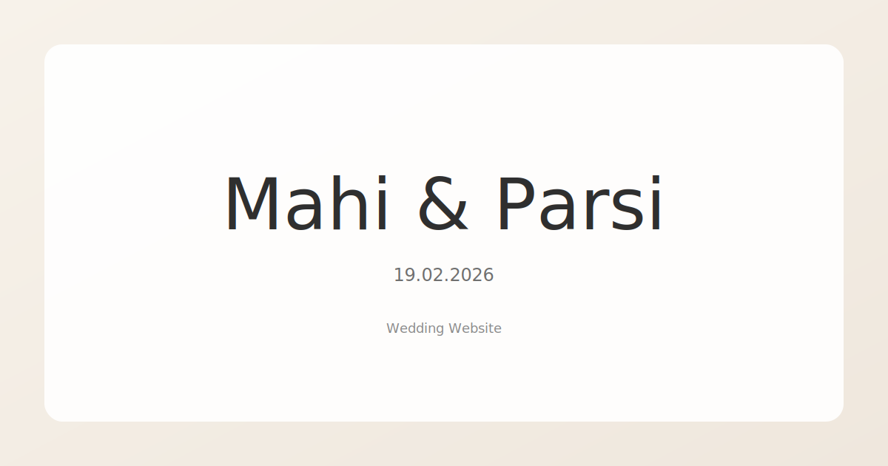

Source code for our wedding website (based on https://freehtml5.co/wedding-free-html5-bootstrap-template-for-wedding-websites)

To set the countdown date see below section in `js/clock.js`

````
  // Target future date/24 hour time/Timezone
  let targetDate = moment.tz("2026-02-19 23:00", "Asia/Kolkata");
````

## Gallery images
- Add gallery photos to `images/gallery/`.
- If your host does not allow directory listing, also list the filenames in `images/gallery.json`.
- The first 5 images show immediately; the 6th tile is a "More Photos" bundle that expands in place.

## Section order / visibility
Edit `config/sections.json` to control which sections appear and their order.

Example:
```json
{
  "order": ["home", "gallery", "highlights", "groom-events", "bride-events"]
}
```

Available keys:
- `home`
- `gallery`
- `highlights`
- `groom-events`
- `bride-events`

## Screenshot

